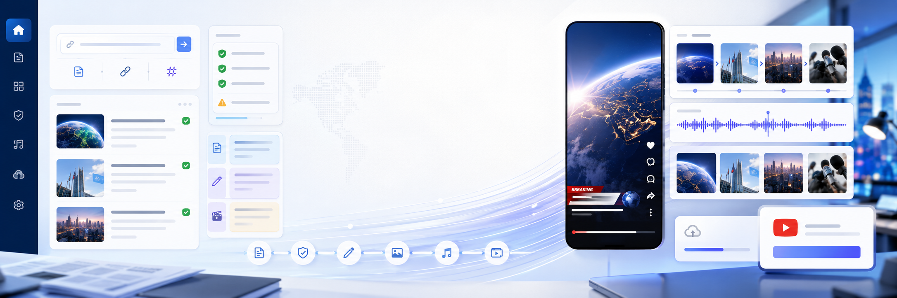
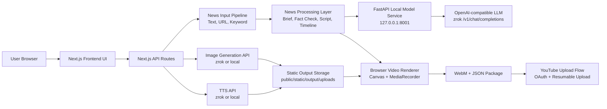

<div align="center">
  

  <h1>News Shorts Studio</h1>
  <p>
    출처 기반 뉴스 입력을 YouTube Shorts용 브리프, 스크립트, 씬 이미지,
    음성, 업로드 패키지로 바꾸는 제작 워크벤치입니다.
  </p>

  <p>
    
    
    
    
  </p>
</div>

## 팀원 역할

- 장준민: 풀스택 개발을 담당합니다. Next.js 프론트엔드 화면, API route, 데이터 흐름, 영상 생성 기능을 연결하고 전체 기능이 안정적으로 동작하도록 구현합니다.
- 채준혁: PM을 담당합니다. 프로젝트 일정, 기능 우선순위, 요구사항 정리, 발표 자료와 팀 커뮤니케이션을 관리합니다.
- 이재빈: AI / API 배포를 담당합니다. 로컬 LLM, 이미지 생성, TTS API 연동과 FastAPI 기반 모델 서버 배포 및 환경변수 설정을 관리합니다.

---

## Overview

News Shorts Studio는 일반 숏츠 생성기가 아니라, 뉴스 콘텐츠 제작에 필요한
출처 확인, 사실 기반 요약, 씬 구성, 업로드 메타데이터 정리를 한 흐름으로 묶은
Next.js 앱입니다.

텍스트 붙여넣기, 기사 URL, 키워드 입력을 받아 브리프와 숏츠 스크립트를 만들고,
이미지와 TTS를 생성한 뒤 브라우저에서 9:16 WebM 영상을 렌더링합니다. YouTube
업로드는 Google OAuth와 resumable upload 흐름을 통해 처리합니다.

## Highlights

| 영역 | 기능 |
| --- | --- |
| 뉴스 입력 | 직접 텍스트, 기사 URL, 키워드 provider adapter |
| 뉴스 처리 | 출처 정규화, 핵심 브리프, 팩트 체크 노트, 숏츠 스크립트 |
| 씬 제작 | 9:16 타임라인, 이미지 프롬프트, 자막용 문장 구성 |
| 모델 연결 | FastAPI 로컬 서비스, OpenAI 호환 LLM, 이미지, TTS zrok 엔드포인트 |
| 영상 생성 | 브라우저 `canvas`와 `MediaRecorder` 기반 WebM 렌더링 |
| 업로드 | Google OAuth, YouTube Data API resumable upload 구조 |
| 안전장치 | 이미지 실패 시 fallback art 저장, 뉴스 사실 확인 안내 |

## Architecture



## User Flow

1. 사용자가 뉴스 원문, 기사 URL, 또는 키워드를 입력합니다.
2. 앱이 입력을 `NewsSource` 형태로 정규화합니다.
3. 브리프, 팩트 체크 노트, 숏츠 스크립트, 씬 타임라인을 생성합니다.
4. 씬별 이미지와 내레이션 음성을 생성합니다.
5. 브라우저가 이미지, 자막, 음성을 합쳐 9:16 WebM 영상을 만듭니다.
6. 사용자가 제목, 설명, 태그, 공개 범위, `madeForKids` 값을 확인합니다.
7. Google OAuth 인증 후 YouTube 업로드 세션으로 영상을 전송합니다.

## Tech Stack

| Layer | Stack |
| --- | --- |
| Web app | Next.js 16, React 19, TypeScript |
| API | Next.js Route Handlers |
| Local model bridge | FastAPI, Uvicorn |
| Image generation | Hugging Face Diffusers or external compatible API |
| TTS | Qwen TTS or external compatible API |
| Video rendering | Browser Canvas, MediaRecorder |
| Upload | Google OAuth, YouTube Data API v3 |

## Project Structure

```text
.
├── app/                         # Next.js app router and API routes
│   └── api/
│       ├── news/                # collect, brief, script, image, voice flows
│       ├── video/               # render route structure
│       ├── auth/google/         # Google OAuth start, callback, status
│       └── youtube/upload/      # YouTube upload endpoints
├── components/                  # Studio UI components
├── lib/                         # News, model, TTS, video, prompt helpers
├── services/                    # FastAPI local model service
├── public/static/output/uploads # Generated image and audio outputs
└── types/                       # Shared TypeScript types
```

## Getting Started

### 1. Install dependencies

```bash
npm install
```

### 2. Create environment file

```bash
cp .env.example .env.local
```

Edit `.env.local`:

```env
LOCAL_MODEL_SERVICE_URL=http://127.0.0.1:8001
LOCAL_IMAGE_API_URL=https://ngoe5jtsustl.shares.zrok.io
LOCAL_LLM_MODEL=qwen3:8b
LOCAL_LLM_BACKEND_URL=https://tw1uxml1imhq.shares.zrok.io/v1
LOCAL_TTS_API_URL=https://n3avtssi8lfm.shares.zrok.io/tts

GOOGLE_CLIENT_ID=
GOOGLE_CLIENT_SECRET=
GOOGLE_REDIRECT_URI=
YOUTUBE_UPLOAD_SCOPE=https://www.googleapis.com/auth/youtube.upload

NEWS_API_KEY=
NEWS_PROVIDER=
```

### 3. Start the Next.js app

```bash
npm run dev
```

The app runs at `http://localhost:3000`.

### 4. Start the local model service

Image, TTS, and LLM proxy flows use the FastAPI service.

```bash
python -m venv .venv
source .venv/bin/activate
pip install -r requirements-local-models.txt
npm run models:dev
```

The model service runs at `http://127.0.0.1:8001`.

## Local Model Service

The FastAPI service loads `.env.local` and `.env` from the project root, then
exposes a small local API for the app.

| Endpoint | Purpose |
| --- | --- |
| `GET /health` | Check service status and active LLM backend |
| `POST /chat` | Proxy chat requests to `LOCAL_LLM_BACKEND_URL` |
| `POST /images` | Generate or fallback-create scene images |
| `POST /tts` | Generate voice audio |

Health check:

```bash
curl http://127.0.0.1:8001/health
```

LLM proxy check:

```bash
curl http://127.0.0.1:8001/chat \
  -H "Content-Type: application/json" \
  -d '{
    "model": "qwen3:8b",
    "messages": [
      { "role": "user", "content": "뉴스 숏츠용으로 한 문장 요약해줘." }
    ],
    "temperature": 0.2
  }'
```

Generated media is written to:

```text
public/static/output/uploads
```

API responses return browser-friendly paths such as:

```text
/static/output/uploads/{file_name}.png
/static/output/uploads/{file_name}.wav
```

## News Input Modes

| Mode | Behavior |
| --- | --- |
| Text | 붙여넣은 원문을 바로 `NewsSource`로 변환합니다. |
| URL | 기사 HTML을 가져와 제목, 매체, 발행일, 본문을 추출합니다. |
| Keyword | `NEWS_API_KEY`, `NEWS_PROVIDER` 기반 adapter를 붙일 수 있는 구조입니다. |

URL 추출은 언론사 HTML 구조에 따라 실패할 수 있습니다. 실패하면 원문 텍스트 입력
모드를 사용하는 것이 가장 안정적입니다.

## Image and TTS Notes

이미지 생성과 TTS는 OpenAI API에 직접 의존하지 않고, 로컬 모델 또는 외부 zrok
엔드포인트를 통해 실행합니다.

| Resource | Default |
| --- | --- |
| TTS model | `Qwen/Qwen3-TTS-12Hz-0.6B-CustomVoice` |
| Image base model | `runwayml/stable-diffusion-v1-5` |
| Image LoRA | `latent-consistency/lcm-lora-sdv1-5` |
| Scheduler | `LCMScheduler` |
| Image size | `512x512` |
| Steps | `num_inference_steps=4` |
| Guidance | `guidance_scale=1.5` |

Apple Silicon에서는 PyTorch MPS를 우선 사용하고, 사용할 수 없거나 TTS 로드가
실패하면 CPU로 fallback합니다. 첫 실행 시 Hugging Face 모델 다운로드 때문에 시간이
걸릴 수 있습니다.

macOS에서 TTS가 `sox`를 요구하면 다음을 설치합니다.

```bash
brew install sox
```

이미지 서비스에서 `peft` 오류가 나면 다음처럼 정리합니다.

```bash
pip uninstall -y torchao
pip install -U "peft>=0.17.0"
```

## YouTube Upload Setup

YouTube 업로드에는 Google OAuth와 YouTube Data API v3 설정이 필요합니다.

```env
GOOGLE_CLIENT_ID=
GOOGLE_CLIENT_SECRET=
GOOGLE_REDIRECT_URI=
YOUTUBE_UPLOAD_SCOPE=https://www.googleapis.com/auth/youtube.upload
```

Google Cloud에서 필요한 작업:

1. Google Cloud 프로젝트를 생성합니다.
2. YouTube Data API v3를 활성화합니다.
3. OAuth consent screen을 설정합니다.
4. OAuth Client ID를 생성합니다.
5. Authorized redirect URI를 등록합니다.
6. 배포 도메인이 있다면 해당 callback URL도 등록합니다.
7. 배포 환경변수에 client id와 secret을 설정합니다.

업로드 흐름:

| Route | Role |
| --- | --- |
| `/api/auth/google/start` | OAuth 인증 시작 |
| `/api/auth/google/callback` | 토큰을 서버 전용 HttpOnly 쿠키에 저장 |
| `/api/youtube/upload/start` | YouTube resumable upload 세션 생성 |
| `/api/youtube/upload` | 업로드 메타데이터 처리 구조 |

## Deployment

Vercel 배포 기준:

1. GitHub 저장소를 Vercel에 연결합니다.
2. Framework Preset은 `Next.js`를 선택합니다.
3. Project Settings의 Environment Variables에 `.env.local` 값을 등록합니다.
4. 배포 URL 기준 Google OAuth callback URI를 Google Cloud에 추가합니다.

Vercel 환경변수 예시:

```env
LOCAL_MODEL_SERVICE_URL=
LOCAL_IMAGE_API_URL=
LOCAL_LLM_MODEL=
LOCAL_LLM_BACKEND_URL=https://tw1uxml1imhq.shares.zrok.io/v1
LOCAL_TTS_API_URL=https://n3avtssi8lfm.shares.zrok.io/tts

GOOGLE_CLIENT_ID=
GOOGLE_CLIENT_SECRET=
GOOGLE_REDIRECT_URI=
YOUTUBE_UPLOAD_SCOPE=https://www.googleapis.com/auth/youtube.upload

NEWS_API_KEY=
NEWS_PROVIDER=
```

## External Access

원격에서 로컬 모델 서비스를 사용하려면 8001 포트를 외부에 노출한 뒤,
생성된 공개 URL을 `LOCAL_MODEL_SERVICE_URL`에 넣습니다.

예시:

```bash
ngrok http 8001
```

zrok을 사용할 경우 LLM, 이미지, TTS 각각의 엔드포인트를 다음 값에 매핑합니다.

```env
LOCAL_LLM_BACKEND_URL=
LOCAL_IMAGE_API_URL=
LOCAL_TTS_API_URL=
```

## Video Rendering

이 앱은 서버에서 MP4를 렌더링하지 않습니다. Vercel 서버리스 환경에서 긴 ffmpeg
작업과 대용량 파일 처리는 안정적이지 않을 수 있기 때문입니다.

대신 브라우저가 다음 자료를 합쳐 WebM을 생성합니다.

- 씬 이미지
- 자막 텍스트
- TTS 오디오
- 9:16 캔버스 타임라인

생성된 WebM은 브라우저에서 YouTube resumable upload URL로 직접 전송할 수 있습니다.

서버 렌더링을 확장한다면 다음 후보를 고려할 수 있습니다.

| Option | Use case |
| --- | --- |
| Remotion Lambda | React 기반 영상 렌더링 |
| Cloud Run | 컨테이너 기반 ffmpeg worker |
| Modal | GPU/CPU 작업 분리 |
| Render API | 상시 실행 render service |
| Supabase Edge Function | 가벼운 후처리 |

## Quality Checks

```bash
npm run lint
npm run build
```

## Safety Notes

- 업로드 기본 공개 범위는 `private`로 두는 것을 권장합니다.
- 뉴스 콘텐츠는 업로드 전 원문 출처, 날짜, 숫자, 인명, 기업명을 확인해야 합니다.
- 한 출처만 있는 주장은 단정하지 말고 “주장했습니다”, “밝혔습니다”처럼 표현합니다.
- 정치와 사회 이슈는 중립적으로 작성합니다.
- 원문에 없는 사실을 추가하지 않습니다.
- 저작권이 있는 이미지, 음악, 방송 화면을 사용하지 않습니다.

## Roadmap

- Keyword news provider adapter 연결
- 제작 패키지 불러오기와 재편집
- 이미지 프롬프트 안전성 점검 강화
- 서버 사이드 렌더링 worker 옵션 추가
- YouTube 업로드 진행률과 실패 복구 UX 개선

---

<div align="center">
  <sub>
    Built for careful news summarization, fast short-form production, and human review before publishing.
  </sub>
</div>
